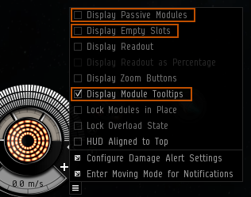
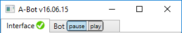

# A-Bot #

A-Bot is an eve online anomaly ratting bot.

### Features ###
* **safe**: does not inject into or write to the eve online client. That is why using it with eve online is not detectable.
* **accurate & robust**: uses memory reading to retrieve information about the game state. In contrast to screen scraping, this approach won't be thrown off by a noisy background or non-default UI settings.
* **easy to use**: automatically detects your fitting and comes with reasonable default settings. Thus you can start using it without any setup.
* **monitors local and saves your ship when neutrals or hostiles show up.**

### Get started ###
Follow these steps to use the bot:

* download the `A-Bot.exe` file of the latest release from the releases section.
* set the language of the eve online client to english.
* start an eve online client and login to the game.
* start the `A-Bot.exe`
* undock, open probe scanner, overview window and drones window.
* in the eve online client, configure the ship UI as follows
 * enable `Display Module Tooltips`
 * disable `Display Passive Modules`
 * 
* wait for the green checkmark to appear in the `Interface` tab header as shown in this screenshot:  (this can take up to 30 seconds)
* press the button `play` to start the bot.
* profit.
